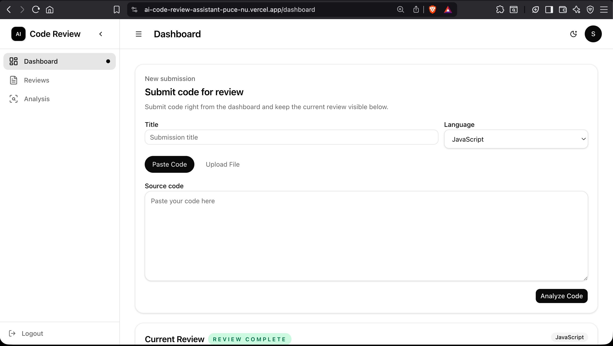
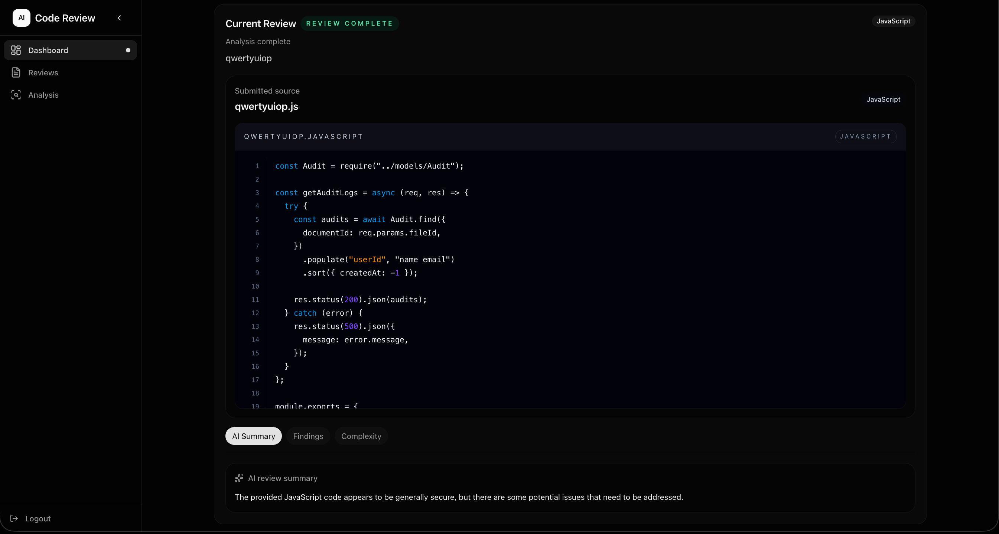
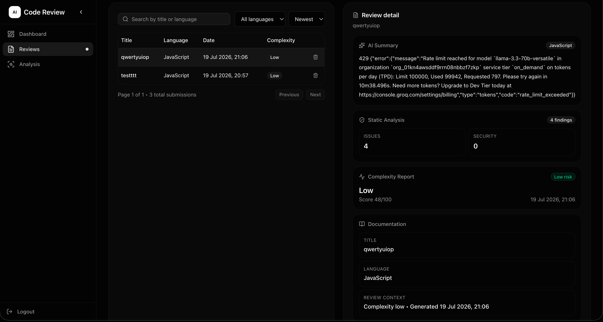
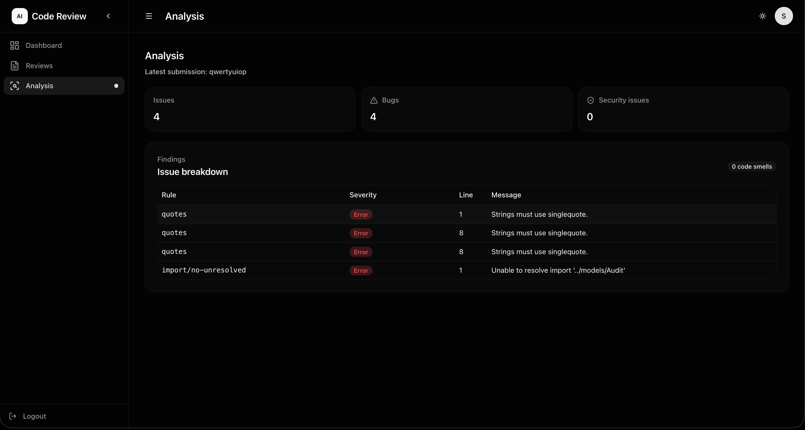

# 🤖 AI Code Review Assistant

An AI-powered code review platform that helps developers analyze source code, detect issues, measure complexity, and receive intelligent review summaries. The application combines static code analysis with Large Language Models (LLMs) to provide actionable feedback through a modern GitHub-inspired interface.

---

## Dashboard





## Review History



## Live Analysis




---

## 🚀 Live Demo

- **Frontend:** https://ai-code-review-assistant-puce-nu.vercel.app

---

## ✨ Features

### 🔐 Authentication
- User Registration & Login
- JWT-based Authentication
- Protected Routes
- Persistent User Sessions

### 📝 Code Submission
- Paste source code directly
- Upload source code files
- Multiple programming language support
- Submission history

### 🤖 AI Code Review
- AI-generated code summaries
- Code quality insights
- Improvement suggestions
- Intelligent review reports

> **Note:** AI summaries are powered by the Groq API and may be temporarily unavailable if the daily free-tier token limit is exceeded.

### 🔍 Static Code Analysis
- ESLint/Pylint integration
- Detects syntax and style issues
- Severity classification
- Rule-based findings

### 📊 Complexity Analysis
- Cyclomatic complexity calculation
- Complexity score
- Risk assessment
- Code health metrics

### 💻 Interactive Code Viewer
- Syntax highlighted source code
- Line numbers
- Click any finding to highlight the corresponding line
- GitHub-style code viewer

### 📂 Review Management
- Review history
- Search submissions
- Filter by language
- Sort reviews
- Delete reviews

### 🎨 Modern UI
- GitHub-inspired dark theme
- Responsive layout
- Dashboard overview
- Interactive tabs
- Smooth user experience

---

# 🛠 Tech Stack

## Frontend
- Next.js
- React
- TypeScript
- Tailwind CSS
- shadcn/ui
- Lucide Icons

## Backend
- Node.js
- Express.js
- PostgreSQL
- JWT Authentication
- Multer

## Database
- PostgreSQL
- Supabase

## AI & Analysis
- Groq API (LLM)
- ESLint
- Pylint

## Deployment
- Vercel (Frontend)
- Render (Backend)
- Supabase (Database)

---

# 📁 Project Structure

```
AI-Code-Review-Assistant
│
├── frontend
│   ├── app
│   ├── components
│   ├── lib
│   └── services
│
├── backend
│   ├── controllers
│   ├── routes
│   ├── middleware
│   ├── services
│   ├── uploads
│   └── utils
│
└── README.md
```

---

# ⚙️ Installation

## Clone Repository

```bash
git clone https://github.com/sowjithchinnu/ai-code-review-assistant.git
```

```bash
cd ai-code-review-assistant
```

---

## Backend Setup

```bash
cd backend
npm install
```

Create a `.env` file:

```env
PORT=8000

DATABASE_URL=your_supabase_database_url

JWT_SECRET=your_secret_key

GROQ_API_KEY=your_groq_api_key
```

Run backend

```bash
npm run dev
```

---

## Frontend Setup

```bash
cd frontend
npm install
```

Create `.env.local`

```env
NEXT_PUBLIC_API_URL=http://localhost:8000
```

Run frontend

```bash
npm run dev
```

---


# 🔮 Future Improvements

- Support additional programming languages
- GitHub repository integration
- Pull Request reviews
- AI-powered code fixes
- Team collaboration
- Export review reports
- Code quality trends & analytics
- Email notifications

---

# 📚 What I Learned

During this project I gained practical experience with:

- Full-stack application development
- Next.js & React
- Express.js REST APIs
- PostgreSQL with Supabase
- JWT Authentication
- File uploads
- AI API integration
- Static code analysis
- Production deployment
- Git & GitHub workflows

---

# 👨‍💻 Author

**Sowjith N**

- GitHub: https://github.com/sowjithchinnu
- LinkedIn: www.linkedin.com/in/nalli-sowjith-kumar-1b17303bb

---

## ⭐ If you found this project interesting, consider giving it a star!